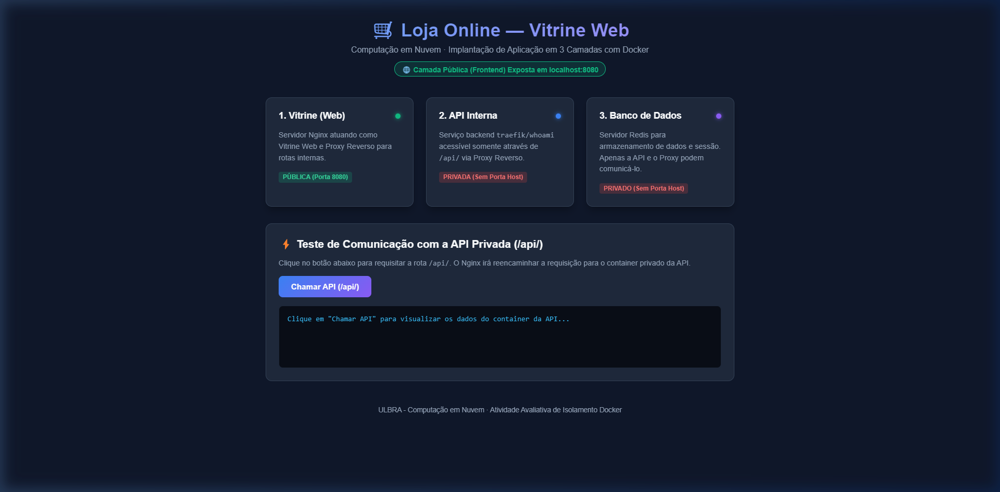
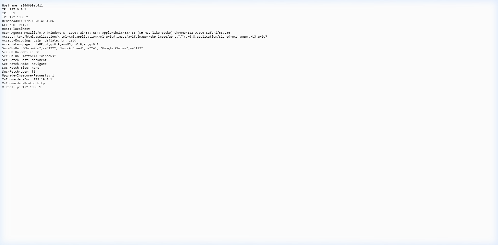
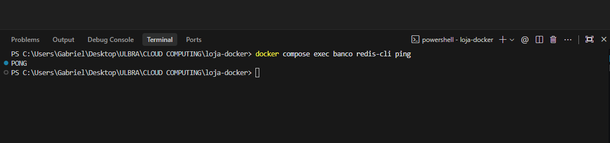
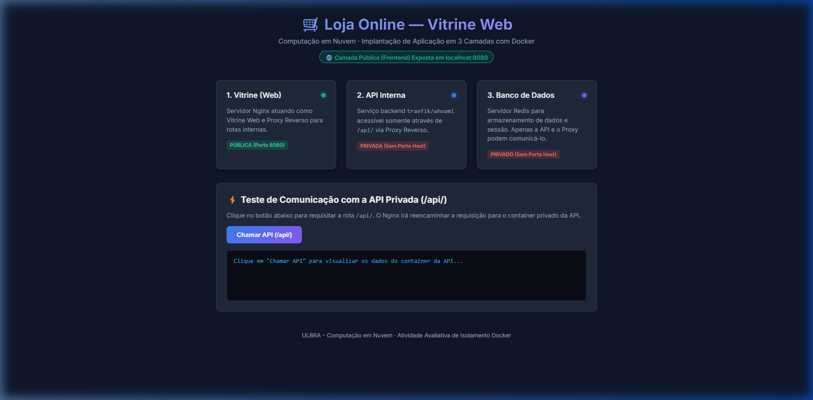
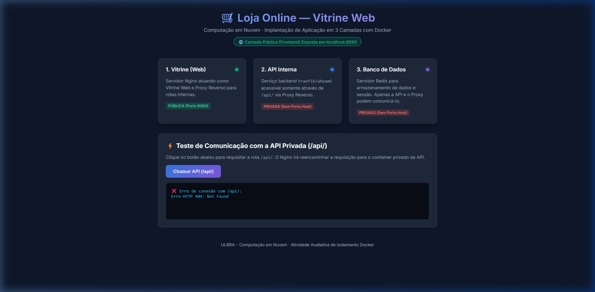

# 📄 Relatório de Entrega — Atividade Avaliativa de Computação em Nuvem
## Implantação de uma Aplicação de Três Camadas com Docker
 
**Aluno:** Gabriel Vaz Aires
**Disciplina:** Computação em Nuvem  
**Instituição:** ULBRA  
**Projeto:** Loja Online (`loja-docker`)  

---

## 🎯 1. Arquivos de Configuração do Projeto

### 📄 1.1 `docker-compose.yml`

```yaml
services:
  web:
    image: nginx:alpine
    container_name: web
    ports:
      - "8080:80"
    volumes:
      - ./web/nginx.conf:/etc/nginx/conf.d/default.conf:ro
      - ./web/html:/usr/share/nginx/html:ro
    depends_on:
      - api
    networks:
      - interna

  api:
    image: traefik/whoami
    container_name: api
    networks:
      - interna

  banco:
    image: redis:alpine
    container_name: banco
    networks:
      - interna

networks:
  interna:
    driver: bridge
```

---

### 📄 1.2 `web/nginx.conf`

```nginx
server {
    listen 80;
    server_name localhost;

    location / {
        root /usr/share/nginx/html;
        index index.html index.htm;
    }

    # Aqui é mascarado o endereço da API via Proxy Reverso
    location /api/ {
        proxy_pass http://api:80/;
        proxy_set_header Host $host;
        proxy_set_header X-Real-IP $remote_addr;
        proxy_set_header X-Forwarded-For $proxy_add_x_forwarded_for;
        proxy_set_header X-Forwarded-Proto $scheme;
    }

    error_page 500 502 503 504 /50x.html;
    location = /50x.html {
        root /usr/share/nginx/html;
    }
}
```

---

## 📸 2. Evidências Práticas e Prints dos Testes

### 🖼️ Evidência 1: Vitrine em `localhost:8080` e API em `localhost:8080/api/` (via Proxy Reverso)

- **Vitrine Web (`http://localhost:8080`):**


- **API via Proxy Reverso (`http://localhost:8080/api/`):**


---

### 🖼️ Evidência 2: Saída do comando `docker compose ps` (Apenas a camada `web` expõe porta)

```text
NAME      IMAGE            COMMAND                  SERVICE   CREATED         STATUS         PORTS
api       traefik/whoami   "/whoami"                api       10 minutes ago  Up 3 minutes   80/tcp
banco     redis:alpine     "docker-entrypoint.s…"   banco     10 minutes ago  Up 3 minutes   6379/tcp
web       nginx:alpine     "/docker-entrypoint.…"   web       10 minutes ago  Up 3 minutes   0.0.0.0:8080->80/tcp, [::]:8080->80/tcp
```
> *Observação: Confirma-se que apenas o serviço `web` possui mapeamento para o hospedeiro (`0.0.0.0:8080->80/tcp`). Os serviços `api` e `banco` possuem apenas portas internas da rede Docker.*

---

### 🖼️ Evidência 3: Resposta do `redis-cli ping` (PONG) executado dentro do container do banco

- **Banco container (`redis-cli`):**


> *Observação: Comprova que o banco de dados Redis está operacional e acessível de dentro da rede privada `interna`.*

---

### 🖼️ Evidência 4: Teste de Isolamento de Falhas (Vitrine no ar e `/api/` em falha)

1. Parando a API com o comando:
   ```bash
   docker compose stop api
   ```

2. **Acesso à Vitrine (`http://localhost:8080`):** A vitrine continua funcionando perfeitamente, servindo o HTML estático.


3. **Chamada à Rota `/api/`:** O Nginx indica falha na conexão com o backend privado, demonstrando que a queda ficou contida apenas na camada de aplicação.


---

## 📝 3. Análise Escrita e Perguntas Reflexivas

### ❓ Pergunta Reflexiva — Tarefa 1
**Que informação o `whoami` devolve, e por que ela é útil para provar "qual contêiner me respondeu" nas próximas tarefas?**

> **Resposta:**  
> O `traefik/whoami` retorna dados operacionais do container que processou a requisição HTTP, como o **Hostname** (que coincide com o ID do container), o **endereço IP interno** atribuído pela rede Docker e os **cabeçalhos HTTP** (headers) recebidos. Essa informação é fundamental para comprovar a arquitetura em 3 camadas, pois ela prova visualmente que a resposta recebida ao acessar `http://localhost:8080/api/` foi gerada diretamente pelo container isolado da API privada, e não pelo Nginx.

---

### ❓ Pergunta Reflexiva — Tarefa 3
**Por que a API não ter porta publicada — e ser alcançada só via `/api` pelo frontend — reproduz uma sub-rede privada do Encontro 3?**

> **Resposta:**  
> Porque a ausência da diretiva `ports` no container da API impede que a máquina hospedeira (ou a internet) estabeleça conexão direta com o serviço. A API reside exclusivamente dentro da rede virtual `interna` do Docker. A única forma de alcançá-la é através do servidor Nginx (posicionado na sub-rede pública com a porta `8080` publicada), que aceita o tráfego externo e o redireciona internamente por Proxy Reverso. Esse comportamento é o equivalente exato de uma **sub-rede privada em uma VPC na nuvem**.

---

### ❓ Pergunta Reflexiva — Tarefa 5
**Por que a home continuou no ar enquanto `/api` caiu? O que esse isolamento entre camadas tem a ver com a alta disponibilidade discutida no Encontro 3?**

> **Resposta:**  
> A home continuou no ar porque o Nginx (frontend) e o `whoami` (API) são microsserviços desacoplados rodando em containers independentes. A interrupção da API afetou apenas os dados dependentes dessa rota, mantendo o frontend disponível para os usuários. Esse isolamento é pilar para a **Alta Disponibilidade (HA)**: ao isolar falhas por camada, é possível adicionar um **Load Balancer** à frente de múltiplas instâncias da API, garantindo que o sistema redirecione o tráfego e permaneça 100% disponível mesmo se uma das instâncias falhar.

---

### ❓ Questão 1 — Análise Escrita
**Se você levasse esta aplicação para a nuvem, quais recursos ficariam na sub-rede pública e quais na privada? Que porta(s) você abriria no grupo de segurança do frontend?**

> **Resposta:**  
> Na **sub-rede pública** ficaria o servidor Nginx (ou um Load Balancer / ALB exposto). Nas **sub-redes privadas** ficariam os containers/instâncias da API (`traefik/whoami`) e o banco de dados (`Redis`).  
> No **Grupo de Segurança (Security Group)** do frontend, seriam abertas apenas as portas de tráfego web: porta **`80`** (HTTP) e porta **`443`** (HTTPS) para a internet (`0.0.0.0/0`), mantendo todas as demais portas (como a 6379 do Redis) estritamente bloqueadas para fora.

---

### ❓ Questão 2 — Análise Escrita
**Pelo modelo de responsabilidade compartilhada (Encontro 1), manter o banco fechado ao mundo é responsabilidade do provedor ou sua? Justifique.**

> **Resposta:**  
> É responsabilidade do **cliente (sua)**. Pelo Modelo de Responsabilidade Compartilhada da Nuvem, o provedor (ex: AWS, Azure, GCP) é responsável pela segurança **DA** nuvem (infraestrutura física, hypervisors e datacenters). O cliente é responsável pela segurança **NA** nuvem, o que inclui regras de firewall, sub-redes, Security Groups e exposição de portas. Portanto, fechar o acesso ao banco e mantê-lo em sub-rede privada é uma decisão de arquitetura e responsabilidade do cliente.

---

### ❓ Questão 3 — Análise Escrita
**No teste da Tarefa 5, a vitrine continuou no ar e só o `/api` caiu. Que peça você adicionaria para que a queda de uma única instância da API não derrubasse a rota `/api`? (Dica: Encontro 3.)**

> **Resposta:**  
> Adicionaria um **Balanceador de Cargas (Load Balancer)** associado a um **Auto Scaling Group** gerenciando múltiplas instâncias da API espalhadas em diferentes Zonas de Disponibilidade (Multi-AZ). O balanceador monitora a saúde das instâncias (*Health Checks*) e, caso uma falhe, desvia o tráfego automaticamente para as instâncias saudáveis remanescentes.

---

### ❓ Questão 4 — Análise Escrita
**Cite duas vantagens de ter isolado a API e o banco em vez de publicá-los diretamente, mesmo em um ambiente pequeno como este.**

> **Resposta:**  
> 1. **Redução da Superfície de Ataque (Segurança):** O banco de dados e a API ficam inacessíveis para varreduras de portas ou ataques diretos vindos da internet.  
> 2. **Desacoplamento e Independência de Camadas:** Permite realizar manutenções, escalonamento e atualizações no backend sem afetar a disponibilidade da vitrine estática, além de esconder a topologia interna da rede.
---

### ❓ Questão 5 — Volume e Armazenamento de Bloco
**O que o volume `dados-banco` representa em termos de nuvem e o que aconteceria sem ele?**

> **Resposta:**  
> O volume `dados-banco` do Redis representa armazenamento persistente semelhante ao **armazenamento de bloco (EBS na AWS)**, pois mantém os arquivos utilizados pelo banco independentemente do ciclo de vida do container. Sem o volume, os dados mantidos apenas no filesystem efêmero do container seriam perdidos quando ele fosse removido com `docker compose down`. O volume nomeado preserva esses dados em disco para reutilização após a recriação do serviço, assim como um disco EBS sobrevive à terminação de uma instância EC2.

---

### ❓ Questão 6 — Imagens e Armazenamento de Objetos
**Por que as imagens dos produtos são armazenadas em Object Storage (MinIO/S3) e não no banco de dados?**

> **Resposta:**  
> Imagens são arquivos não estruturados e se encaixam melhor em armazenamento de objetos. O MinIO representa esse modelo, no qual arquivos são armazenados como **objetos dentro de buckets**, de forma semelhante ao Amazon S3. Dessa maneira, o banco Redis continua responsável pelos dados estruturados da aplicação (chave-valor), enquanto imagens e outros arquivos binários ficam em um serviço específico para objetos, com suporte nativo a versionamento, metadados e políticas de ciclo de vida.

---

### ❓ Questão 7 — Versionamento e Ciclo de Vida
**Como o versionamento protege contra erros e qual o cuidado com custo de armazenamento?**

> **Resposta:**  
> O versionamento mantém versões anteriores quando um objeto é sobrescrito, permitindo recuperar uma imagem apagada ou substituída por engano. Isso reduz drasticamente o impacto de erros humanos. Como versões antigas ocupam espaço adicional, pode-se utilizar uma **Política de Ciclo de Vida (Lifecycle Policy)** para excluir automaticamente versões não atuais após determinado período (ex: 30 dias) ou, em provedores de nuvem que ofereçam classes de armazenamento, movê-las para uma opção mais econômica (ex: S3 Glacier na AWS).

---